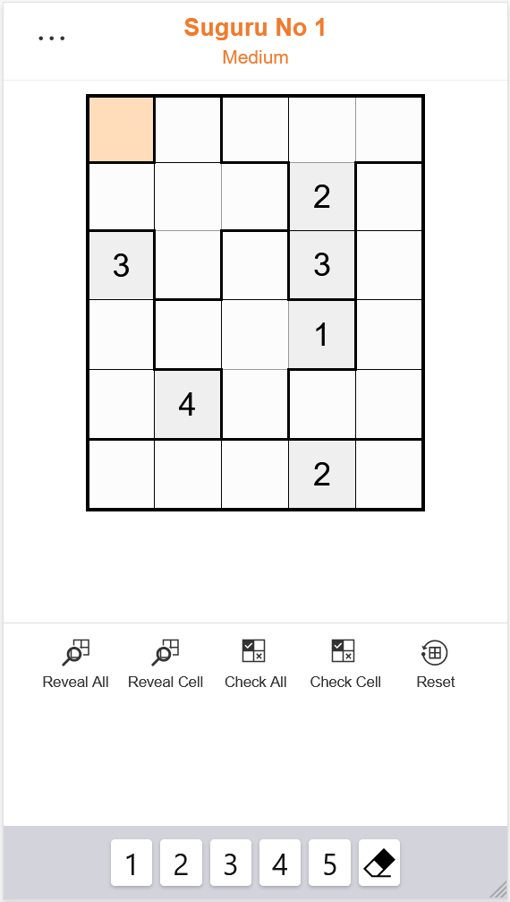

# Suguru coding test

Suguru is a grid-based logic puzzle similar to Sudoku. A grid of cells is divided into outlined blocks containing up
to five cells. Each cell in an outlined block must contain a digit: a two-cell block contains the digits 1 and 2, a
three-cell block contains the digits 1, 2 and 3; and so on. The same digit must not appear in neighbouring cells, not
even diagonally.

Suguru grid                    |    Suguru solution grid
  :-----------------------------:|:-------------------------------:     
  |   |    

The initial state of the puzzle shows the grid, the outlined blocks and some initial numbers filled in as clues. When
the puzzle is completed all the cells contain a number.

## Instructions

The objective of this test is to use javascript to build the grid and keyboard from the data provided in the
[puzzle-data.js](js/puzzle-data.js) javascript file. The data corresponds to the screenshots of the puzzle.

* Use plain Javascript, jQuery or Vue.js, whichever you prefer.
* Any CSS classes you need should be available in [suguru.css](css/suguru.css). Use your browser inspector to show the
index page in a mobile layout to match the screenshots.
* Inspect the data in [puzzle-data.js](js/puzzle-data.js) and see how it relates to the layout in the screenshots and
how it defines the initial grid, the outlined blocks and the solution grid.
* Build the grid with the initial state of the puzzle.
* Build the keyboard with the valid numbers for the keys.
* Set the title and difficulty.
* You do not need to build a working puzzle, just the initial layout from the data provided.
